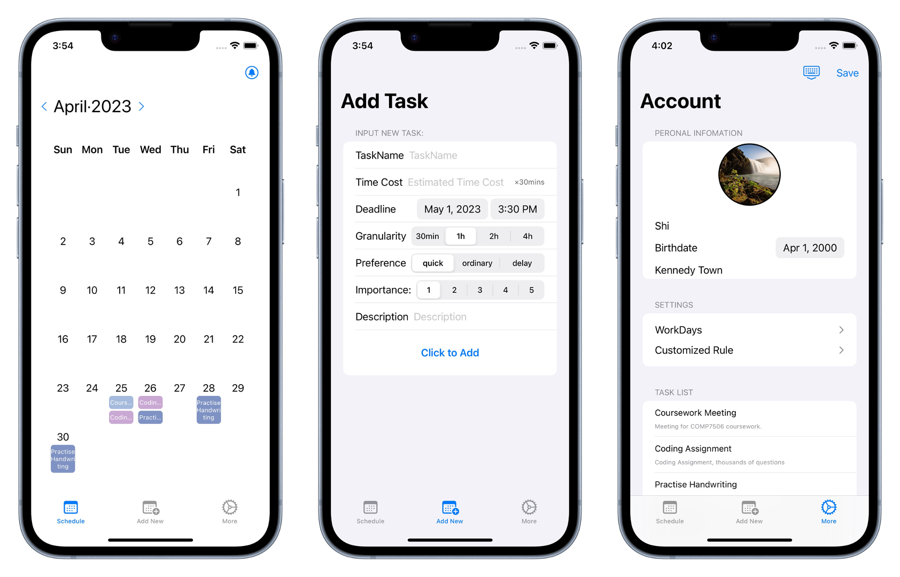
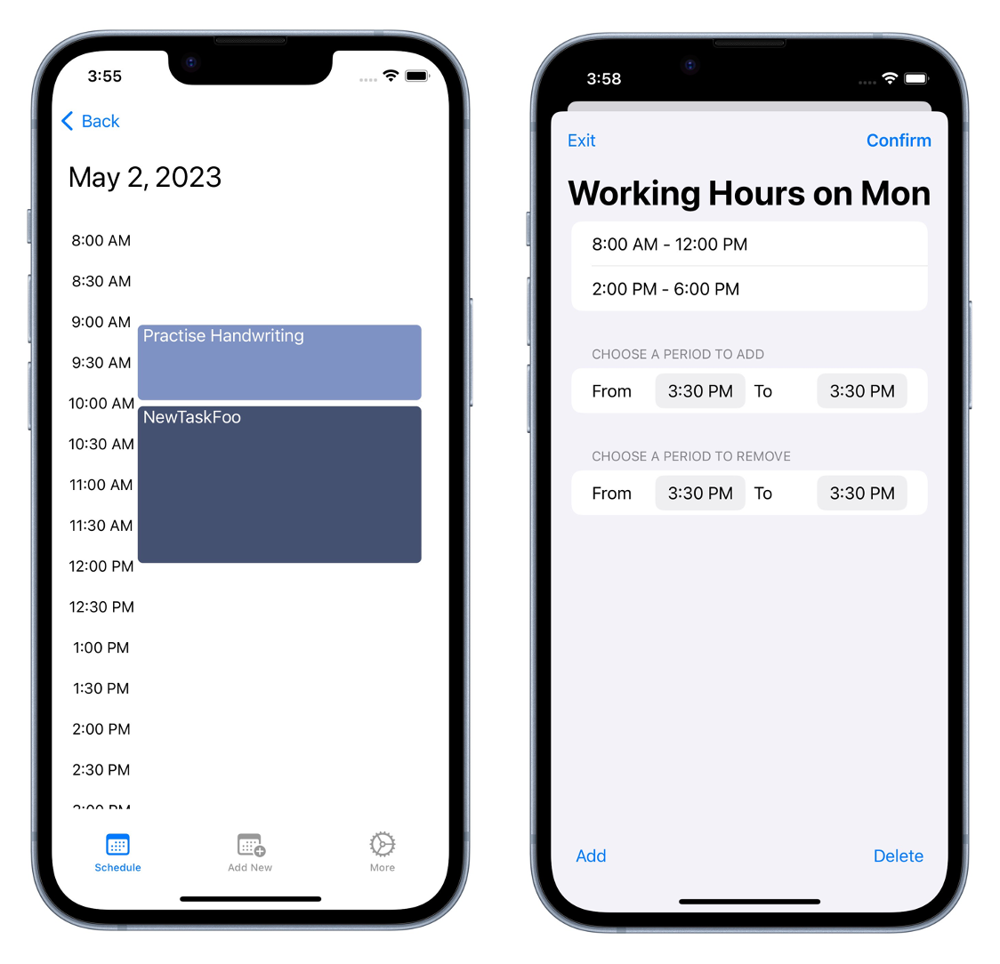

# ToDoScheduler

- Not a to-do list

- But help you **Schedule** your to-do list

- All you need to do is input the **deadline**, estimate the **time cost**, and add the task

- ToDoScheduler would split tasks into time slices and arrange them to suitable time slots, following pre-set rules and your preferences

- Great for situations when ddls overstocking, or during final weeks, or anytime you find it difficult to appropriately arranging tasks and ensuring there being no conflicts

## Environments

* macOS Ventura 13.3
* Xcode 14.2
* iOS Device Simulator

## Demonstration

<iframe width="560" height="315" src="https://www.youtube.com/embed/du9SDzAqko8" title="YouTube video player" frameborder="0" allow="accelerometer; autoplay; clipboard-write; encrypted-media; gyroscope; picture-in-picture; web-share" allowfullscreen></iframe>

## Others

This project is the teamwork for assignment of HKU's COMP7506 Smart Phone Apps Development.

